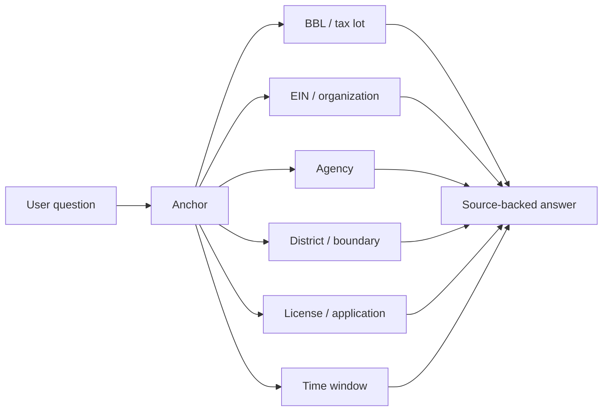

# Akil MCP - New York City Edition

[](https://www.npmjs.com/package/akil-mcp)
[](LICENSE)
[](https://askakil.ai/mcp)

### NYC public records for AI agents.

Akil MCP connects Claude, ChatGPT, Codex, and custom agents to a hosted civic
data layer built around real workflows, reusable identifiers, and source-backed
public records.

The product is the hosted MCP server. This repository is the public connection
home for developers, evaluators, and partner teams who want to understand what
Akil can do before connecting an agent.

## Connect

There is nothing to install for normal use.

**MCP endpoint:** `https://mcp.askakil.ai/mcp`

| Client | How to connect |
|--------|----------------|
| Claude | Add Akil as a custom connector, paste the MCP URL, and sign in when prompted. |
| ChatGPT | Use connectors where available, add the MCP URL, and complete the Akil authorization flow. |
| Codex | Register Akil as a streamable HTTP MCP server. Developer access can send an API key as a bearer token. |
| Custom agents | Use OAuth for user-authorized sessions or API keys for backend jobs and partner workflows. |

Full setup and docs:

- [MCP overview](https://askakil.ai/mcp)
- [Developer docs](https://askakil.ai/mcp/docs)
- [Claude setup](docs/connect-claude.md)
- [ChatGPT setup](docs/connect-chatgpt.md)
- [Codex setup](docs/connect-codex.md)
- [Authentication](docs/auth.md)
- [Structured output](docs/structured-output.md)

## What agents can do

Akil is organized around civic workflows rather than a single dataset.

| Workflow | What the assistant can check |
|----------|------------------------------|
| Business location | Permits, licenses, inspections, operating context, and location constraints |
| Property diligence | Ownership, tax-lot identity, deeds, sales, permits, violations, and tax records |
| Public money | Awards, payments, contracts, agency budgets, and recipient history |
| Influence and government | Lobbying, campaign finance, legislation, votes, hearings, and officeholder context |
| Organization checks | Nonprofit registries, audits, funding history, compliance records, and aliases |
| Spatial questions | Address, BBL, district, neighborhood, radius, polygon, corridor, and time-windowed queries |

## Why this exists

A general model can reason. Akil gives it records to reason from.

The useful part is not the number of tools. It is that fragmented public
records come back with stable identifiers, source context, and next steps an
assistant can actually follow.

## Anchor-first design

Akil responses are designed to keep agents oriented around durable civic
identifiers:



- `BBL` for tax lots, buildings, ownership, permits, sales, tax records, and violations
- `EIN` for nonprofits, audits, awards, filings, and organization checks
- `Agency` for budgets, contracts, payments, rules, hearings, and payroll context
- `District` or other boundaries for place-based questions
- `License` and application identifiers for regulated businesses
- `Time window` for bounded, usable queries

These anchors let an assistant move from one public record system to another
without losing the subject of the question.

## Example prompts

```text
I am looking at a storefront lease. What public records should I check before signing?
```

```text
Who owns this building, and are there recent permits or violations tied to the tax lot?
```

```text
Show public funding, contracts, and payments tied to this organization.
```

```text
What changed in this council district over the last year?
```

```text
Is this restaurant, liquor, tobacco, cannabis, or sidewalk-cafe location worth checking more closely?
```

See the workflow recipes:

- [Business location](examples/business-location.md)
- [Property diligence](examples/property-diligence.md)
- [Nonprofit due diligence](examples/nonprofit-due-diligence.md)
- [Public money](examples/public-money.md)
- [Spatial query](examples/spatial-query.md)

## Standards and discovery

For clients, directories, and evaluators that probe machine-readable surfaces:

- **Server Card:** [`https://mcp.askakil.ai/.well-known/mcp/server-card.json`](https://mcp.askakil.ai/.well-known/mcp/server-card.json) (also at `/.well-known/mcp.json`)
- **OAuth resource metadata:** `https://mcp.askakil.ai/.well-known/oauth-protected-resource` (RFC 9728)
- **Protocol:** serves current-era MCP clients (protocol revision `2026-07-28`) and 2025-era legacy clients on the same endpoint
- **Health:** `https://mcp.askakil.ai/health` reports version and live tool count
- **Tool behavior:** every tool is read-only and non-destructive, declares MCP safety annotations, returns a source-attribution footer, and states plainly when a search is capped or empty
- **Registry manifest:** [`server.json`](./server.json) in this repository

## What this repository is

This public repository contains:

- connection metadata
- setup notes
- workflow examples
- public-facing security contact information

It does not contain the hosted server implementation, data pipelines, database
schema, private infrastructure, or internal operating documents.

## Public surfaces

- Product: [askakil.ai](https://askakil.ai)
- MCP overview: [askakil.ai/mcp](https://askakil.ai/mcp)
- Developer docs: [askakil.ai/mcp/docs](https://askakil.ai/mcp/docs)
- Company: [akilventures.com](https://akilventures.com)
- Contact: [hello@akilventures.com](mailto:hello@akilventures.com)

## Security

Please do not post tokens, API keys, private prompts, or sensitive records in
GitHub issues. See [SECURITY.md](SECURITY.md) for reporting guidance.

## About

Akil is built by [Akil Ventures, Inc.](https://akilventures.com), a Delaware
corporation building civic intelligence infrastructure for AI agents.

## License

MIT. This public repository documents the hosted MCP server and lightweight
connection metadata. The hosted Akil service runs proprietary infrastructure
and is not open source.
